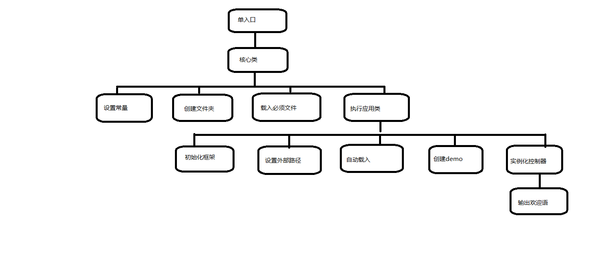
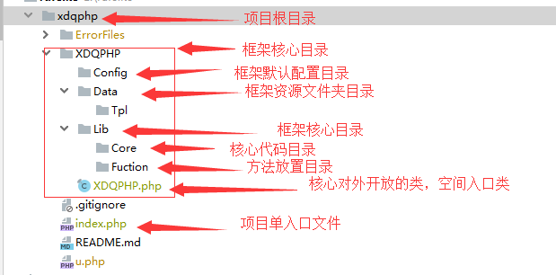

# PHP 框架开发

## 参考学习教程

开学网：http://www.kaixuewang.com 打造自己的PHP框架

## 框架整体流程



## 定义被外部引用的类

- 文件名`XDQPHP.php`，处于框架`\XDQPHP`文件夹中，作为框架对外的入口类。 

- 创建框架主体目录结构（ErrorFiles目录和u.php为upupw集成环境自动生成，与框架无关)

  

- 定义框架对外开放的类，第一个被被外部引用的类。

  - 入口文件index.php 引入核心中相对XDQPHP.php；

  ```php
  <?php
      define('APP_NAME','Index');//定义应用目录名称
      require_once('./XDQPHP/XDQPHP.php');
  
  ```

  

  - 定义对外开放类XDQPHP.php，执行入口文件，输出XDQPHP即可。代码结构如下：

  ```php
  <?php
  
  /**
   * 核心加载类
   * Class XDQPHP
   */
  final class XDQPHP{
     //自动运行类
     public static function run(){
         var_dump("XDQPHP");
     }
  }
  
  XDQPHP::run();//执行核心类
  
  ?>
  
  ```

  

### 定义框架框架默认路径常量

- 在入口XDQPHP类中定义一个方法`_set_const()`用于配置框架和应用使用的常量。方便框架内部使用

- 注意1：处理window/linux等不同系统下的资源分隔符，统一处理为`/`

- 注意2：统一风格，所有关于路径的常量最后不带资源分隔符`/`

- 代码实现

  ```php
  <?php
  
  /**
   * 核心加载类
   * Class XDQPHP
   */
  final class XDQPHP{
     //自动运行类
     public static function run(){
         self::_set_const();
     }
  
      /**
       * 配置框架常量方法
       * 统一风格，常量后面不带资源分割符
       */
    private static function _set_const(){
         //统一控制分隔符为'/'
         $path = str_replace('\\','/',__FILE__);
  
         define('XDQPHP_PATH',dirname($path));//框架根目录路径
         define('CONFIG_PATH',XDQPHP_PATH.'/Config');//框架默认配置目录路径
         define('DATA_PATH',XDQPHP_PATH.'/Data');//框架默认资源目录路径
         define('LIB_PATH',XDQPHP_PATH.'/Lib');//框架默认核心目录路径
         define('CORE_PATH',LIB_PATH.'/Core');//框架默认核心目录路径
         define('FUNCTION_PATH',LIB_PATH.'/Function');//框架默认方法目录路径
  
         //用户应用相关路径
         define('ROOT_PATH',dirname(XDQPHP_PATH));//项目根路径
        
         define('TEMP_PATH',ROOT_PATH.'/'.'Temp');//临时目录路径
         define('LOG_PATH',TEMP_PATH.'/'.'Log');//日记记录路径
        
         define('APP_PATH',ROOT_PATH.'/'.APP_NAME);//应用目录路径 APP_NAME需要在入口文件处定义
         define('APP_CONFIG_PATH',APP_PATH.'/'.'Config');//用户应用配置目录路径
         define('APP_CONTROLLER_PATH',APP_PATH.'/'.'Controller');//用户应用控制器目录路径
         define('APP_TPL_PATH',APP_PATH.'/'.'Tpl');//用户应用模板目录路径
         define('APP_PUBLIC_PATH',APP_PATH.'/'.'Public');//应用静态资源目录路径
     }
  }
  
  XDQPHP::run();//执行核心类
  
  ?>
  
  ```


### 定义IS_POST和IS_AJAX常量

- 在入口类中`XDQPHP.php`的`_set_const()`方法定义这两个常量
- 可以根据系统函数`$_SERVER['REQUEST_METHOD']`和`S_SERVER['HTTP_X_REQUESTED_WITH']`来动态定义常量
- 判断否为ajax提交,ajax提交时，$_SERVER系统数组变量中会产生一个`HTTP_X_REQUESTED_WITH`键，值为`XMLHttpRequest`

```php
<?php
/**
     * 配置框架常量方法
     * 统一风格，常量后面不带资源分割符
     */
   private static function _set_const(){
       //统一控制分隔符为'/'
       $path = str_replace('\\','/',__FILE__);

       define('XDQPHP_PATH',dirname($path));//框架根目录路径
       define('CONFIG_PATH',XDQPHP_PATH.'/Config');//框架默认配置目录路径
       define('DATA_PATH',XDQPHP_PATH.'/Data');//框架默认资源目录路径
       define('TPL_PATH',DATA_PATH.'/Tpl');//框架默认模板文件目录路径
       define('LIB_PATH',XDQPHP_PATH.'/Lib');//框架默认核心目录路径
       define('CORE_PATH',LIB_PATH.'/Core');//框架默认核心目录路径
       define('FUNCTION_PATH',LIB_PATH.'/Function');//框架默认方法目录路径

       //用户应用相关路径
       define('ROOT_PATH',dirname(XDQPHP_PATH));//项目根路径
       define('TEMP_PATH',ROOT_PATH.'/'.'Temp');//临时目录路径
       define('LOG_PATH',TEMP_PATH.'/'.'Log');//日记存储目录路径

       define('APP_PATH',ROOT_PATH.'/'.APP_NAME);//应用目录路径 APP_NAME需要在入口文件处定义
       define('APP_CONFIG_PATH',APP_PATH.'/'.'Config');//用户应用配置目录路径
       define('APP_CONTROLLER_PATH',APP_PATH.'/'.'Controller');//用户应用控制器目录路径
       define('APP_TPL_PATH',APP_PATH.'/'.'Tpl');//用户应用模板目录路径
       define('APP_PUBLIC_PATH',APP_TPL_PATH.'/'.'Public');//应用静态资源目录路径

       //动态定义方法方式常量
       define('IS_POST',($_SERVER['REQUEST_METHOD']=='POST')?true:false);//是否为post提交
       //根据S_SERVER['HTTP_X_REQUESTED_WITH']否为ajax提交,ajax提交时，$_SERVER系统数组变量中会产生一个HTTP_X_REQUESTED_WITH键，值为XMLHttpRequest
       if(isset($_SERVER['HTTP_X_REQUESTED_WITH'])&&$_SERVER['HTTP_X_REQUESTED_WITH']=='XMLHttpRequest'){
           define('IS_AJAX',true);
       }else{
           define('IS_AJAX',false);
       }


   } 
?>
```


### 用户应用目录自动创建

- 作用放置开发项目代码

- 创建`_create_dir()`方法，用于自动创建已经在`_set_const()`方法中已经定义好的用户应用相关常量路径。

- 在入口类中的`run()`方法中，调用`_create_dir()`方法

- 代码：

  ```php
  <?php
  
  /**
   * 核心加载类
   * Class XDQPHP
   */
  final class XDQPHP{
     //自动运行类
     public static function run(){
         self::_set_const();//常量配置方法
         self::_create_dir();//自动创建用户应用目录方法
     }
  
      /**
       * 配置框架常量方法
       * 统一风格，常量后面不带资源分割符
       */
     private static function _set_const(){
         //统一控制分隔符为'/'
         $path = str_replace('\\','/',__FILE__);
  
         define('XDQPHP_PATH',dirname($path));//框架根目录路径
         define('CONFIG_PATH',XDQPHP_PATH.'/Config');//框架默认配置目录路径
         define('DATA_PATH',XDQPHP_PATH.'/Data');//框架默认资源目录路径
         define('LIB_PATH',XDQPHP_PATH.'/Lib');//框架默认核心目录路径
         define('CORE_PATH',LIB_PATH.'/Core');//框架默认核心目录路径
         define('FUNCTION_PATH',LIB_PATH.'/Function');//框架默认方法目录路径
  
         //用户应用相关路径
         define('ROOT_PATH',dirname(XDQPHP_PATH));//项目根路径
         
         define('TEMP_PATH',ROOT_PATH.'/'.'Temp');//临时目录路径
         define('LOG_PATH',TEMP_PATH.'/'.'Log');//日记记录路径
         
         define('APP_PATH',ROOT_PATH.'/'.APP_NAME);//应用目录路径 APP_NAME需要在入口文件处定义
         define('APP_CONFIG_PATH',APP_PATH.'/'.'Config');//用户应用配置目录路径
         define('APP_CONTROLLER_PATH',APP_PATH.'/'.'Controller');//用户应用控制器目录路径
         define('APP_TPL_PATH',APP_PATH.'/'.'Tpl');//用户应用模板目录路径
         define('APP_PUBLIC_PATH',APP_TPL_PATH.'/'.'Public');//应用静态资源目录路径
  
     }
  
     /*
      * 自动创建用户目录方法
      */
     private static function _create_dir(){
         $arr = array(
             APP_PATH,
             APP_CONFIG_PATH,
             APP_CONTROLLER_PATH,
             APP_TPL_PATH,
             APP_PUBLIC_PATH,
             TEMP_PATH,
             LOG_PATH
         );
  
         foreach($arr as $v){
             //判读目录是否存在，不存在则创建
             //mkdir() 0777给予最高权限，true递归创建项目
             is_dir($v) || mkdir($v,0777,true);
         }
  
     }
  }
  
  XDQPHP::run();//执行核心类
  
  ?>
  
  ```


### 公共目录和自动动创建

- 用于用户配置公共配置项和系统公共类文件

- 创建与用户应用目录方式创建一致，需要先在`_set_const()`方法中定义对应的路径常量，再使用`_create_dir`创建对应的文件夹

- 启动类`Application`类中的`_init()`中加载配置顺序改成 系统配置=>公共配置=>用户配置

- 代码

  `XDQPHP.php`中代码

  ```php
  <?php
  /**
   * 核心加载类
   * Class XDQPHP
   */
  final class XDQPHP{
     //自动运行类
     public static function run(){
         self::_set_const();//常量配置方法
         self::_create_dir();//自动创建用户应用目录方法
         self::_import_file();//自动引入文件方法
         Application::run();
     }
  
      /**
       * 配置框架常量方法
       * 统一风格，常量后面不带资源分割符
       */
     private static function _set_const(){
         //统一控制分隔符为'/'
         $path = str_replace('\\','/',__FILE__);
  
         define('XDQPHP_PATH',dirname($path));//框架根目录路径
         define('CONFIG_PATH',XDQPHP_PATH.'/Config');//框架默认配置目录路径
         define('DATA_PATH',XDQPHP_PATH.'/Data');//框架默认资源目录路径
         define('TPL_PATH',DATA_PATH.'/Tpl');//框架默认模板文件目录路径
         define('LIB_PATH',XDQPHP_PATH.'/Lib');//框架默认核心目录路径
         define('CORE_PATH',LIB_PATH.'/Core');//框架默认核心目录路径
         define('FUNCTION_PATH',LIB_PATH.'/Function');//框架默认方法目录路径
  
         //用户应用相关路径
         define('ROOT_PATH',dirname(XDQPHP_PATH));//项目根路径
         define('TEMP_PATH',ROOT_PATH.'/'.'Temp');//临时目录路径
         define('LOG_PATH',TEMP_PATH.'/'.'Log');//日记存储目录路径
  
         define('APP_PATH',ROOT_PATH.'/'.APP_NAME);//应用目录路径 APP_NAME需要在入口文件处定义
         define('APP_CONFIG_PATH',APP_PATH.'/'.'Config');//用户应用配置目录路径
         define('APP_CONTROLLER_PATH',APP_PATH.'/'.'Controller');//用户应用控制器目录路径
         define('APP_TPL_PATH',APP_PATH.'/'.'Tpl');//用户应用模板目录路径
         define('APP_PUBLIC_PATH',APP_TPL_PATH.'/'.'Public');//应用静态资源目录路径
  
         //公共目录相关
         define('COMMON_PATH',ROOT_PATH.'/'.'Common');//公共文件目录路径
         define('COMMON_CONFIG_PATH',COMMON_PATH.'/'.'Config');//公共文件配置目录路径
         define('COMMON_MODEL_PATH',COMMON_PATH.'/'.'Model');//公共文件模型目录路径
         define('COMMON_LIB_PATH',COMMON_PATH.'/'.'Lib');//公共库文件目录路径
  
         //动态定义方法方式常量
         define('IS_POST',($_SERVER['REQUEST_METHOD']=='POST')?true:false);//是否为post提交
         //根据S_SERVER['HTTP_X_REQUESTED_WITH']否为ajax提交,ajax提交时，$_SERVER系统数组变量中会产生一个HTTP_X_REQUESTED_WITH键，值为XMLHttpRequest
         if(isset($_SERVER['HTTP_X_REQUESTED_WITH'])&&$_SERVER['HTTP_X_REQUESTED_WITH']=='XMLHttpRequest'){
             define('IS_AJAX',true);
         }else{
             define('IS_AJAX',false);
         }
  
     }
  
     /*
      * 自动创建用户目录方法
      */
     private static function _create_dir(){
         $arr = array(
             COMMON_PATH,
             COMMON_CONFIG_PATH,
             COMMON_MODEL_PATH,
             COMMON_LIB_PATH,
             APP_PATH,
             APP_CONFIG_PATH,
             APP_CONTROLLER_PATH,
             APP_TPL_PATH,
             APP_PUBLIC_PATH,
             TEMP_PATH,
             LOG_PATH
         );
  
         foreach($arr as $v){
             //判读目录是否存在，不存在则创建
             //mkdir() 0777给予最高权限，true递归创建项目
             is_dir($v) || mkdir($v,0777,true);
         }
  
         //初始化引入成功或失败跳转模板文件
         is_file(APP_TPL_PATH.'/'.'success.html') || copy(TPL_PATH.'/'.'success.html',APP_TPL_PATH.'/'.'success.html');
         is_file(APP_TPL_PATH.'/'.'error.html') || copy(TPL_PATH.'/'.'error.html',APP_TPL_PATH.'/'.'error.html');
     }
  
      /**
       * 自动引入文件方法
       */
      private static function _import_file(){
          $arr = array(
              FUNCTION_PATH.'/'.'function.php',//框架自定义方法
              CORE_PATH.'/'.'Log.class.php',//引入日志记录类
              CORE_PATH.'/'.'Controller.class.php',//用户应用类父类
              CORE_PATH.'/'.'Application.class.php',//用户应用入口类
          );
  
          foreach($arr as $v){
              require_once($v);
          }
      }
  
  
  }
  
  XDQPHP::run();//执行核心类
  
      
      
  ?>
  ```

  `Application.class.php`文件中的`_init()`方法代码

  ```php
  <?php
  	/**
       * 初始化框架
       */
      private static function _init(){
          //加载系统默认配置项
          C(include CONFIG_PATH.'/'.'config.php');
  
          //加载公共配置项
          $commonPath = COMMON_CONFIG_PATH.'/'.'config.php';
          $commonConfg=<<<str
  <?php
  /**
  * 公共配置项目
  */
  
  return array(
      //配置项 => 配置值
  );
  
  ?>
  str;
          //判断公共配置文件是否存在，不存在则创建
          is_file($commonPath) || file_put_contents($commonPath,$commonConfg);
          //加载配置
          C(include $commonPath);
  
  
  
          //加载用户配置项
          $userPath = APP_CONFIG_PATH.'/'.'config.php';
          $userConfg=<<<str
  <?php
  /**
  * 用户配置项目
  */
  
  return array(
      //配置项 => 配置值
  );
  
  ?>
  str;
          //注意：如果用户配置项已存在，则直接加载，不存在则创建后再加载
          is_file($userPath) || file_put_contents($userPath,$userConfg);
          //加载用户配置项目
          C(include $userPath);
  
          //设置默认时区
          date_default_timezone_set(C('DEFAULT_TIME_ZONE'));
  
          //是否开启session
          C('SESSION_AUTO_START') && session_start();
  
          //调试模式设置 默认关闭
          !C('DEBUG') && error_reporting(0);//抑制所有错误
      }
      
      
      
  ?>
  ```

  

### 自动引入文件方法

- 创建`_import_file()`方法，用于自动引入指定路径的文件，如核心框架`XDQPHP\Lib\Function`目录中的function.php方法文件和核心框架`XDQPHP\Lib\Core`目录中的Application.php应用类文件。

- 在入口类中的`run()`方法中，调用`_import_file()`方法

- 代码

  ```php
  <?php
  
  /**
   * 核心加载类
   * Class XDQPHP
   */
  final class XDQPHP{
     //自动运行类
     public static function run(){
         self::_set_const();//常量配置方法
         self::_create_dir();//自动创建用户应用目录方法
         self::_import_file();//自动引入文件方法
     }
  
      /**
       * 配置框架常量方法
       * 统一风格，常量后面不带资源分割符
       */
     private static function _set_const(){
         //统一控制分隔符为'/'
         $path = str_replace('\\','/',__FILE__);
  
         define('XDQPHP_PATH',dirname($path));//框架根目录路径
         define('CONFIG_PATH',XDQPHP_PATH.'/Config');//框架默认配置目录路径
         define('DATA_PATH',XDQPHP_PATH.'/Data');//框架默认资源目录路径
         define('LIB_PATH',XDQPHP_PATH.'/Lib');//框架默认核心目录路径
         define('CORE_PATH',LIB_PATH.'/Core');//框架默认核心目录路径
         define('FUNCTION_PATH',LIB_PATH.'/Function');//框架默认方法目录路径
  
         //用户应用相关路径
         define('ROOT_PATH',dirname(XDQPHP_PATH));//项目根路径
         define('TEMP_PATH',ROOT_PATH.'/'.'Temp');//临时目录路径
         define('LOG_PATH',TEMP_PATH.'/'.'Log');//日记记录路径
         
         define('APP_PATH',ROOT_PATH.'/'.APP_NAME);//应用目录路径 APP_NAME需要在入口文件处定义
         define('APP_CONFIG_PATH',APP_PATH.'/'.'Config');//用户应用配置目录路径
         define('APP_CONTROLLER_PATH',APP_PATH.'/'.'Controller');//用户应用控制器目录路径
         define('APP_TPL_PATH',APP_PATH.'/'.'Tpl');//用户应用模板目录路径
         define('APP_PUBLIC_PATH',APP_TPL_PATH.'/'.'Public');//应用静态资源目录路径
  
     }
  
     /*
      * 自动创建用户目录方法
      */
     private static function _create_dir(){
         $arr = array(
             APP_PATH,
             APP_CONFIG_PATH,
             APP_CONTROLLER_PATH,
             APP_TPL_PATH,
             APP_PUBLIC_PATH,
             TEMP_PATH,
             LOG_PATH
         );
  
         foreach($arr as $v){
             //判读目录是否存在，不存在则创建
             //mkdir() 0777给予最高权限，true递归创建项目
             is_dir($v) || mkdir($v,0777,true);
         }
     }
  
      /**
       * 自动引入文件方法
       */
      private static function _import_file(){
          $arr = array(
              CORE_PATH.'/'.'Log.class.php',//框架日记记录类
              FUNCTION_PATH.'/'.'function.php',//框架自定义方法
              CORE_PATH.'/'.'Application.class.php',//用户应用类
          );
  
          foreach($arr as $v){
              require_once($v);
          }
      }
  
  
  }
  
  XDQPHP::run();//执行核心类
  
  ?>
  
  ```


## 配置文件

- 系统默认配置文件，文件名`config.php`，位置处于`\XDQPHP\Config`中，系统默认配置项

- 用户配置文件，文件名`config.php`，位置处于`\用户应用目录\Confg`中，用户配置项，默认为返回空数组

- 系统配置项，如调试开关、session开关、时区设置等

- 配置文件config.php

  ```php
  <?php
      
  return array(
      //配置项 => 配置值
      'DEBUG' => true,//调试模式 默认打开
      'DEFAULT_TIME_ZONE' => 'PRC',//设置默认时区
      'SESSION_AUTO_START' => true,//是否可开启session 默认开启
  );
  
  ?>
  ```

  

## 配置文件读取函数 C()

- 在框架函数文件function.php中创建一个`C()`函数，用于加载配置项、动态设置配置项

- 注意：加载用户配置项应该在系统配置项之后，确保用户配置项级别高于系统配置项目（覆盖）

- 代码实现

  ```php
  <?php
      
  /**
   * 读取配置项函数
   * 功能1：一个数组参数，加载配置项 C($sysConfig) C($userConfig);
   * 功能2：一个字符串参数，读取指定配置项 C('DEBUG');
   * 功能3：两个参数，动态设置配置项目 C('DEBUG',true);
   * 功能4：不传参数，直接读取所有配置项 C();
   *
   * @param null $ck 指定配置项键名或存储数组
   * @param null $cv  自定配置项的值
   * @return null || array()
   */
  function C($ck=null,$cv=null){
      static $config = array();
  
      //如果第一个参数是数组，则加载配置，合并系统配置和用户配置
      if(is_array($ck)){
          $config = array_merge($config,array_change_key_case($ck,CASE_UPPER));
          return;
      }
  
      //如果第一个参数是字符串
      if(is_string($ck)){
          $var = strtoupper($ck);
          //两个参数的情况
          if(!is_null($cv)){
              $config[$ck] = $cv;
              return;
          }
  
          //只有一个字符串参数的情况下，返回指定的配置项。注意：不存在的参数时，返回null;
          return isset($config[$ck])?$config[$ck]:null;
      }
  
      //参数为空时，返回所有配置项目
      if(is_null($ck) && is_null($ck)){
          return $config;
      }
  
  }
      
  ?>
      
  ```

  

## 定义核心加载类

- 文件名`Application.php`，位置处于`\XDQPHP\Lib`中，用于初始化框架

- 系统核心加载类，用于初始化框架，提供对外调用方法`run()`

- App初始化类：Application.php 

  ```php
  <?php
  final class Application{
      // 对外接口方法
      public static function run(){
          self::_init();
      }
  
  ?>
  str;
          is_file($userPath) || file_put_contents($userPath,$userConfg);
          //加载用户配置项目
          C(include $userPath);
  
      }
  }
  
  
  ?>
      
  ```

  

### 系统初始化方法 _init()

- 加载配置项目，设置时区、session开关等配置

```php
<?php
final class Application{
    // 对外接口方法
    public static function run(){
        self::_init();
    }

    /**
     * 初始化框架
     */
    private static function _init(){
        //加载系统默认配置项
        C(include CONFIG_PATH.'/'.'config.php');

        //加载用户配置项 注意：如果用户配置项已存在，则直接加载，不存在则创建后在加载
        $userPath = APP_CONFIG_PATH.'/config.php';
        $userConfg=<<<str
<?php
/**
* 用户配置项目
*/

return array(
    //配置项 => 配置值
);

?>
str;
        is_file($userPath) || file_put_contents($userPath,$userConfg);
        //加载用户配置项目
        C(include $userPath);
        //设置默认时区
        date_default_timezone_set(C('DEFAULT_TIME_ZONE'));

        //是否开启session
        C('SESSION_AUTO_START') && session_start();

        //调试模式设置 默认关闭
        !C('DEBUG') && error_reporting(0);//抑制所有错误

    }
}


?>
    
```


### 设置外部访问路径常量

- 在应用类方法中定义外部访访问路径常量，方便框架使用

```php
<?php
final class Application{
    // 对外接口方法
    public static function run(){
        self::_init();//初始化框架
        self::_set_url();//设置外部访问路径
    }

    /**
     * 初始化框架
     */
    private static function _init(){
        //加载系统默认配置项
        C(include CONFIG_PATH.'/'.'config.php');

        //加载用户配置项
        $userPath = APP_CONFIG_PATH.'/config.php';
        $userConfg=<<<str
<?php
/**
* 用户配置项目
*/

return array(
    //配置项 => 配置值
);

?>
str;
        //注意：如果用户配置项已存在，则直接加载，不存在则创建后再加载
        is_file($userPath) || file_put_contents($userPath,$userConfg);
        //加载用户配置项目
        C(include $userPath);

        //设置默认时区
        date_default_timezone_set(C('DEFAULT_TIME_ZONE'));

        //是否开启session
        C('SESSION_AUTO_START') && session_start();

        //调试模式设置 默认关闭
        !C('DEBUG') && error_reporting(0);//抑制所有错误
    }


    /**
     * 设置外部访问路径常量,方便框架使用
     */
    private static function _set_url(){
        //获取访问协议类型
        $http_type = ((isset($_SERVER['HTTPS']) && $_SERVER['HTTPS'] == 'on') || (isset($_SERVER['HTTP_X_FORWARDED_PROTO']) && $_SERVER['HTTP_X_FORWARDED_PROTO'] == 'https')) ? 'https://' : 'http://';
        $path = $http_type.$_SERVER['HTTP_HOST'].$_SERVER['SCRIPT_NAME'];
        //处理资源分隔符问题
        $path = str_replace('\\','/',$path);
        define('__APP__',$path);//当前文件路径
        define('__ROOT__',dirname($path));//项目根目录
        define('__TPL__',__ROOT__.'/'.APP_NAME.'/'.'Tpl');//项目资源目录路径
        define('__PUBLIC__',__TPL__.'/'.'Public');//项目静态资源目录路径
        

    }

}       
    
?>
```


### 注册类文件自动加载

- 使用`spl_autoload_register()`函数注册类加载
- 再`Application`类中定义`_autoload()`方法，设置类自动加载规则

```php
<?php
final class Application{
    // 对外接口方法
    public static function run(){
        self::_init();//初始化框架
        self::_set_url();//设置外部访问路径
        spl_autoload_register(array(__CLASS__,'_autoload'));//注册类自动加载
    }
    
    /**
     * 类自动加载处理方法
     */
    private static function _autoload($className){
        //根据实例化类名称，查找对应的类文件引入
        $filePath = APP_CONTROLLER_PATH.'/'.$className.'.class.php';
        if(file_exists($filePath)){
            require_once($filePath);
        }else{
            die($filePath.'类文件不存在');
        }
    }

    /**
     * 初始化框架
     */
    private static function _init(){
        //加载系统默认配置项
        C(include CONFIG_PATH.'/'.'config.php');

        //加载用户配置项
        $userPath = APP_CONFIG_PATH.'/config.php';
        $userConfg=<<<str
<?php
/**
* 用户配置项目
*/

return array(
    //配置项 => 配置值
);

?>
str;
        //注意：如果用户配置项已存在，则直接加载，不存在则创建后再加载
        is_file($userPath) || file_put_contents($userPath,$userConfg);
        //加载用户配置项目
        C(include $userPath);

        //设置默认时区
        date_default_timezone_set(C('DEFAULT_TIME_ZONE'));

        //是否开启session
        C('SESSION_AUTO_START') && session_start();

        //调试模式设置 默认关闭
        !C('DEBUG') && error_reporting(0);//抑制所有错误
    }


    /**
     * 设置外部访问路径常量,方便框架使用
     */
    private static function _set_url(){
        //获取访问协议类型
        $http_type = ((isset($_SERVER['HTTPS']) && $_SERVER['HTTPS'] == 'on') || (isset($_SERVER['HTTP_X_FORWARDED_PROTO']) && $_SERVER['HTTP_X_FORWARDED_PROTO'] == 'https')) ? 'https://' : 'http://';
        $path = $http_type.$_SERVER['HTTP_HOST'].$_SERVER['SCRIPT_NAME'];
        //处理资源分隔符问题
        $path = str_replace('\\','/',$path);
        define('__APP__',$path);//当前文件路径
        define('__ROOT__',dirname($path));//项目根目录
        define('__TPL__',__ROOT__.'/'.APP_NAME.'/'.'Tpl');//项目资源目录路径
        define('__PUBLIC__',__TPL__.'/'.'Public');//项目静态资源目录路径


    }

}    
    
?>
```


### 创建应用Demo

- 在Application中定义一个自动创建Demo的方法`_create_demo()`
- 用户访问时，框架自动创建默认访问Deme,方便用户快速入门
- 方法定义如下：

```php
<?php
	/**
     *  创建默认访问路径和演示demo
     */
    private static function _create_demo(){
        $path = APP_CONTROLLER_PATH.'/'.'IndexController.class.php';
        $str = <<<str
<?php
class IndexController extends Controller{
    public function index(){
        echo "欢迎使用XDQPHP框架 （：";
    }
}

?>
str;
        //判断文件是否存在，不存在则创建对应的文件
        is_file($path) || file_put_contents($path,$str);

    }    
    
?>
```

### 自动实例化方法

- 在`Application`中创建自动实例化方法`_app_run()`
- 根据系统配置项中的控制器访问符和方法访问符，进行组合和实例化，`spl_autoload_register()`函数根据实例化的类名自动引入对应的类文件
- 实例化后，执行默认的访问方法达到自动访问首页

```php
<?php
/**
 * Created by 框架应用类。
 * user: rufeike
 * email: rufeike@163.com
 * Date：2019/11/4
 * Time: 16:06
 */

final class Application{
    // 对外接口方法
    public static function run(){
        self::_init();//初始化框架
        self::_set_url();//设置外部访问路径
        spl_autoload_register(array(__CLASS__,'_autoload'));//注册类自动加载
        self::_create_demo();//自动创建Demo文件
        self::_app_run();//自动实例化和运行访问方法
    }


    /**
     * 自动实例化和运行目录指定控制器和方法
     */
    private static function _app_run(){
        $c = isset($_GET[C('ACCESS_CONTROLLER')])?$_GET[c('ACCESS_CONTROLLER')]:"Index";
        define('CONTROLLER',$c);//定义控制器常量
        $a = isset($_GET[C('ACCESS_ACTION')])?$_GET[c('ACCESS_ACTION')]:"index";
        define('ACTION',$a);//定义方法常量
        $c .= 'Controller';//组合类全称
        $obj = new $c();//实例化控制器
        $obj->$a();//调用方法
    }


    /**
     *  创建默认访问路径和演示demo
     */
    private static function _create_demo(){
        $path = APP_CONTROLLER_PATH.'/'.'IndexController.class.php';
        $str = <<<str
<?php
class IndexController{
    public function index(){
        echo "欢迎使用XDQPHP框架";
    }
}

?>
str;
        //判断文件是否存在，不存在则创建对应的文件
        is_file($path) || file_put_contents($path,$str);

    }

    /**
     * 类自动加载处理方法
     */
    private static function _autoload($className){
        //根据实例化类名称，查找对应的类文件引入
        $filePath = APP_CONTROLLER_PATH.'/'.$className.'.class.php';
        if(file_exists($filePath)){
            require_once($filePath);
        }else{
            die($filePath.'类文件不存在');
        }
    }

    /**
     * 初始化框架
     */
    private static function _init(){
        //加载系统默认配置项
        C(include CONFIG_PATH.'/'.'config.php');

        //加载用户配置项
        $userPath = APP_CONFIG_PATH.'/config.php';
        $userConfg=<<<str
<?php
/**
* 用户配置项目
*/

return array(
    //配置项 => 配置值
);

?>
str;
        //注意：如果用户配置项已存在，则直接加载，不存在则创建后再加载
        is_file($userPath) || file_put_contents($userPath,$userConfg);
        //加载用户配置项目
        C(include $userPath);

        //设置默认时区
        date_default_timezone_set(C('DEFAULT_TIME_ZONE'));

        //是否开启session
        C('SESSION_AUTO_START') && session_start();

        //调试模式设置 默认关闭
        !C('DEBUG') && error_reporting(0);//抑制所有错误
    }


    /**
     * 设置外部访问路径常量,方便框架使用
     */
    private static function _set_url(){
        //获取访问协议类型
        $http_type = ((isset($_SERVER['HTTPS']) && $_SERVER['HTTPS'] == 'on') || (isset($_SERVER['HTTP_X_FORWARDED_PROTO']) && $_SERVER['HTTP_X_FORWARDED_PROTO'] == 'https')) ? 'https://' : 'http://';
        $path = $http_type.$_SERVER['HTTP_HOST'].$_SERVER['SCRIPT_NAME'];
        //处理资源分隔符问题
        $path = str_replace('\\','/',$path);
        define('__APP__',$path);//当前文件路径
        define('__ROOT__',dirname($path));//项目根目录
        define('__TPL__',__ROOT__.'/'.APP_NAME.'/'.'Tpl');//项目资源目录路径
        define('__PUBLIC__',__TPL__.'/'.'Public');//项目静态资源目录路径


    }

}

?>
```


## 定义控制器公用的父类

- 控制器父类类文件名称 `Controller.class.php`
- 该文件放置与`Application.class.php`入口类同一个目录中
- 需要在入口类`XDQPHP.php`中`_import_file()`方法中引入该类，且该类需要先于`Application.class.php`文件引入。

```php
<?php
	/**
     * 自动引入文件方法
     */
    private static function _import_file(){
        $arr = array(
            FUNCTION_PATH.'/'.'function.php',//框架自定义方法
            CORE_PATH.'/'.'Controller.class.php',//用户应用类父类
            CORE_PATH.'/'.'Application.class.php',//用户应用入口类
        );

        foreach($arr as $v){
            require_once($v);
        }
    }
?>
```


- 该类用作所有用户定义的应用类父类，可以在类中定义一下公共的方法

```php
<?php
class Controller{
    /**
     * 成功访问方法
     */
    public function success(){

    }

}    
?>
```


### 增加初始方法__ init()和 __ auto()

-在`Controller.class.php`的`Controller`类中构造方法中增加判断，如果子类中有`__auto()或 __init()`方法时，则执行对应的方法，实现自动初始方法

- 注意：`__init()`和`__auto()`两个直属的之类中，如果父类使用了其中一个，子类只能使用另一个

```php
<?php
class Controller{
    public function __construct(){
        if(method_exists($this,'__init')){
            $this->__init();
        }
        if(method_exists($this,'__auto')){
            $this->__auto();
        }
    }

}    
?>
```


### 增加成功跳转方法success()

- 在`Controller.class.php`的`Controller`类中添加`success()`方法
- 在子类中可以直接使用`$this->success('成功信息','http://www.baidu.com',3)`调用

```php
<?php
class Controller{
    /**
     * 成功跳转方法
     * @param $msg 跳转信息
     * @param null $url 跳转地址
     * @param int $time 跳转时间
     */
    public function success($msg,$url=null,$time=3){
        $url = $url?"window.location.href='".$url."'":'window.history.back(-1)';

        //引入跳转页面
        include(APP_TPL_PATH.'/'.'success.html');
        die();
    }
}    
?>
```


### 增加失败跳转方法error()

在`Controller.class.php`的`Controller`类中添加`error()`方法

在子类中可以直接使用`$this->success('成功信息','http://www.baidu.com',3)`调用

```php
class Controller{
    /**
     * 失败跳转方法
     * @param $msg 跳转信息
     * @param null $url 跳转地址
     * @param int $time 跳转时间
     */
    public function error($msg,$url=null,$time=3){
        $url = $url?"window.location.href='".$url."'":'window.history.back(-1)';

        //引入跳转页面
        include(APP_TPL_PATH.'/'.'error.html');
        die();
    }


}
```


### 自动载入模板display()

- 引入对应的模板文件，默认模板存储路径为`/应用目录/Tpl/应用控制器类名`中，如`Index`应用目录中，`IndexController`控制器的`index()`方法中调用了`$this->display()`方法后，会在`Index`应用目录中找`Tpl\Index/index.html`模板文件
- 父类`Controller1`控制器中定义`display()`方法

```php
<?php
	/**
     * 自动引入模板
     * @param null $tpl
     */
    protected function display($tpl=null){
        if(is_null($tpl)){
            $path = APP_TPL_PATH.'/'.CONTROLLER.'/'.ACTION.'.html';
        }else{
            //判断用户是否定义引入文件后缀名
            $suffix = strrchr($tpl,'.');
            $tpl = empty($suffix)?$tpl.'.html':$tpl;
            $path = APP_TPL_PATH.'/'.CONTROLLER.'/'.$tpl;
        }

        //判断模板文件是否存在
        if(!is_file($path)){
            halt($path.'模板文件不存在');
        }
    	
    	//把用户自定义的变量转成模板使用变量
        extract($this->param);
    	
        require_once($path);
    }
    
?>
```


### 定义模板变量 assign()

- 把用户定义变量传入的模板中使用
  - 父类`Controller`中定义一个`assign()`方法和一个`param`属性，用于传输用户自定义变量用于模板文件中
- 使用PHP系统函数把数组中的数据变成变量

```php
<?php
  	private $param = array();
    /**
     * 模板变量传输方法
     * @param $key
     * @param $value
     */
    protected function assign($key,$value){
        $this->param[$key] = $value;
    }  
    
?>
```


### 成功和失败跳转模板文件

- 放置路径：`XDQPHP/Data/Tpl`文件夹中
- 在入口类`XDQPHP.php`中初始化创建应用目录方法中`_create_dir()`，复制到对应的应用目录
- 成功跳转模板`success.html`

```html
<!DOCTYPE html>
<html lang="en">
<head>
    <meta charset="UTF-8">
    <title>成功跳转</title>
    <style>
        *{
            margin:0;
            padding:0;
        }
        body{
            display:flex;
        }
        .content_box{
            width:500px;
            min-width: 250px;
            height:250px;
            background-color: #cccccc;
            position:absolute;
            top:50%;
            left:50%;
            transform:translate(-50%,-50%);
            border-radius: 5px;
        }
        header{
            background-color: #cdcdcd;
            height: 35px;
            line-height: 35px;
            border-radius:5px 5px 0 0;
            font-weight: 700;
            padding:0 15px;
            color:#FFFFFF;
        }
        .jump_box{
            background-color: #eeeeee;
            height:200px;
        }
        .msg_box{
            padding:15px;
            height:120px;
            line-height: 30px;
            text-align: center;
        }
        .timer{
            letter-spacing: 2px;
            height:50px;
            text-align: center;
            margin-bottom: 0;
        }
        .time{
            display: inline-block;
            width:30px;
            color:#ff0000;
        }
    </style>
</head>
<body>
    <script>
        window.setTimeout("<?php echo $url; ?>",<?php echo $time;?>*1000);
    </script>
    <div class="content_box">
        <header>操作成功</header>
        <div class="jump_box">
            <div class="msg_box"><?php echo $msg ?></div>
            <div class="timer"><span id="time" class="time"><?php echo $time; ?></span>秒钟后将进行<a href="javascript:<?php echo $url; ?>">跳转</a>，点击返回<a href="<?php echo __ROOT__; ?>">首页</a></div>
        </div>
    </div>

    <script>
        window.onload = function(){
            var time = document.getElementById('time').innerHTML;
            setInterval(function(){
                time--;
                if(time>0){
                    document.getElementById('time').innerHTML = time;
                }
            },1000);
        }
    </script>
</body>
</html>
```

- 失败跳转模板`error.html`

```html
<!DOCTYPE html>
<html lang="en">
<head>
    <meta charset="UTF-8">
    <title>成功跳转</title>
    <style>
        *{
            margin:0;
            padding:0;
        }
        body{
            display:flex;
        }
        .content_box{
            width:500px;
            min-width: 250px;
            height:250px;
            background-color: #cccccc;
            position:absolute;
            top:50%;
            left:50%;
            transform:translate(-50%,-50%);
            border-radius: 5px;
        }
        header{
            background-color: #cdcdcd;
            height: 35px;
            line-height: 35px;
            border-radius:5px 5px 0 0;
            font-weight: 700;
            padding:0 15px;
            color:#FFFFFF;
        }
        .jump_box{
            background-color: #eeeeee;
            height:200px;
        }
        .msg_box{
            padding:15px;
            height:120px;
            line-height: 30px;
            text-align: center;
        }
        .timer{
            letter-spacing: 2px;
            height:50px;
            text-align: center;
            margin-bottom: 0;
        }
        .time{
            display: inline-block;
            width:30px;
            color:#ff0000;
        }
    </style>
</head>
<body>
<script>
    window.setTimeout("<?php echo $url; ?>",<?php echo $time;?>*1000);
</script>
<div class="content_box">
    <header>操作失败</header>
    <div class="jump_box">
        <div class="msg_box"><?php echo $msg ?></div>
        <div class="timer"><span id="time" class="time"><?php echo $time; ?></span>秒钟后将进行<a href="javascript:<?php echo $url; ?>">跳转</a>，<a href="<?php echo __ROOT__; ?>">首页</a></div>
    </div>
</div>

<script>
    window.onload = function(){
        var time = document.getElementById('time').innerHTML;
        setInterval(function(){
            time--;
            if(time>0){
                document.getElementById('time').innerHTML = time;
            }
        },1000);
    }
</script>
</body>
</html>

```


## 框架日志处理类

- 作用：记录框架执行的错误日志
- 类文件名：`Log.class.php`
- 类名：`Log`
- 类文件放置位置：`XDQPHP/Lib/Core`中，入口文件初始化时，需要引入该文件

- 需要在系统配置项中配置日志记录开启`SAVE_LOG => true`

```php
<?php
class log{
    /**
     * 错误日志写入方法
     * @param $msg 错误信息
     * @param string $level 错误等级
     * @param int $type 错误记录方式 默认为3，写入文件方式
     * @param null $dest 错误日记记录路径
     */
    public static function write($msg,$level='ERROR',$type=3,$dest=null){
        //判断日记记录是否开启
        if(!C('SAVE_LOG')){
            return;
        }

        //判断是否指定存储路径
        if(is_null($dest)){
            $dest = LOG_PATH.'/'.date('Y_m_d').".log";
        }

        $log_msg = "[TIME]:".date('Y-m-d H:i:s')." [LEVEL]:{$level} [MSG]:{$msg}\r\n";
        if(is_dir(LOG_PATH)){
            //使用系统error_log()记录日志;
            //error_log('错误方式',"错误记录类型","记录地址","")
            error_log($log_msg,$type,$dest);
        }else{
            mkdir(LOG_PATH,0777,true);
            error_log($log_msg,$type,$dest);
        }
    }

}
    
    
?>
```

- 调用方式`Log::write($msg,$level,$type,$dest)`

```php
<?php
    Log::write('记录第一条日志');
?>
    
```

- 记录结果 在默认的`/Temp/Log`文件夹中会生成当前日期的`.log`日记记录文件

```html
[TIME]:2019-11-07 16:07:00 [LEVEL]:ERROR [MSG]:记录第一条日志
```


## 框架自定义函数

### 框架打印函数dump()

```php
<?php
/**
 * 自定义打印带格式的打印函数
 * @param $var
 * @param $type 是否需要带格式，默认带格式输出
 */
function dump($var,$type=false){
    if(!$type){
        echo "<pre style='padding:5px 15px;line-height:30px;border:1px solid #f5f5f5;border-radius:5px;background-color: #f5f5f5'>";
        if (is_string($var)) {
            echo $var;
        } else if (is_array($var)) {
            print_r($var);
        } else {
            var_dump($var);
        }
        echo "</pre>";
    }else{
        if (is_string($var)) {
            echo $var;
        } else if (is_array($var)) {
            print_r($var);
        } else {
            var_dump($var);
        }
    }
}    
    
?>

```

打印效果

```html
//普通字符串
欢迎使用XDQPHP框架 (:
//NUll
NULL
//对象
object(Application)#2 (0) {
}
//数组
Array
(
    [0] => 1
    [1] => 3
    [2] => 32030
)
```


### 框架跳转函数go()

```php
<?php
/**
 * 跳转函数
 * @param $url 跳转地址
 * @param int $time 跳转时间
 * @param string $msg 跳转信息
 */
function go($url,$time=0,$msg=''){
    //检测头部是否已返送
    if(!headers_sent()){
        $time = 0 ? header('Location:'.$url):header("refresh:{$time};url={$url}");
        die();//终止后续程序
    }else{//头部已发送的情况
        echo "<meta http-equiv='Refresh' content='{$time};URL={$url}'>";
        if($time) die("<div style='margin:100px auto;text-align: center'>".$msg."</div>");
    }
}    
    
?>
```


### 程序终止函数halt()

- 作用：用于记录错误信息和错误位置追踪

```php
<?php
/**
 * 代码追踪测试
 * @param $error
 * @param string $level
 * @param int $type
 * @param null $dest
 */
function halt($error,$level='ERROR',$type=3,$dest=null){
    //本地记录日志
    if(is_array($error)){
        Log::write($error['message'],$level,$type,$dest);
    }else{
        Log::write($error,$level,$type,$dest);
    }

    //错误信息存储
    $e = array();

    if(C('DEBUG')){//调试开启时
        if(!is_array($error)){
            $trace = debug_backtrace();
            $e['message'] = $error;//错误信息
            $e['file'] = $trace[0]['file'];//错误文件路径
            $e['line'] = $trace[0]['line'];//错误行号
            $e['class'] = isset($trace[0]['class'])?$trace[0]['class']:'';//错误类
            $e['function'] = isset($trace[0]['function'])?$trace[0]['function']:'';//错误方法

            //获取执行追踪路径信息,开启缓存，在缓存区中输出，再获取缓存区的数据
            ob_start();
            debug_print_backtrace();
            $e['trace'] = htmlspecialchars(ob_get_clean());//对应数据实体化，防止破坏页面布局
        }else{
            $e=$error;
        }
    }else{
        //如果用户填写了错误跳转地址，则跳转，否则页面输出错误信息
        if($url = C('ERROR_URL')){
           go($url);
        }else{
           $e['message'] = C('ERROR_MSG');
        }
    }

    //引入代码追踪页面
    require(TPL_PATH.'/'.'halt.html');
    die();//终止后续代码执行
}    
    
?>
```

- 方法中直接调用`halt()`函数打印效果

```html
:（
错误信息调试:（
错误位置:
E:\rufeike\xdqphp\Index\Controller\IndexController.class.php 行号：4
Trace:
#0 halt(错误信息调试) called at [E:\rufeike\xdqphp\Index\Controller\IndexController.class.php:4]
#1 IndexController->index() called at [E:\rufeike\xdqphp\XDQPHP\Lib\Core\Application.class.php:29]
#2 Application::_app_run() called at [E:\rufeike\xdqphp\XDQPHP\Lib\Core\Application.class.php:17]
#3 Application::run() called at [E:\rufeike\xdqphp\XDQPHP\XDQPHP.php:20]
#4 XDQPHP::run() called at [E:\rufeike\xdqphp\XDQPHP\XDQPHP.php:96]
#5 require_once(E:\rufeike\xdqphp\XDQPHP\XDQPHP.php) called at [E:\rufeike\xdqphp\index.php:11]
XDQPHP开源框架

```


### halt代码追踪页面

```html
<!DOCTYPE html>
<html lang="en">
<head>
    <meta charset="UTF-8">
    <title>代码追踪</title>
    <style>
        body{
            background-color: #eeeeee;
        }
        .container{padding:15px;}
        .pic{
            font-size: 60px;
        }
        .msg{
            font-size:15px;
            margin:15px 0;
        }
        .trace_box_header{
            font-size: 18px;
            font-weight: 700;
        }
        .trace_box{
            margin:15px 0;
        }
        .autho_box{
            font-size: 18px;
            font-weight: 700;
        }
        div{background-color: #FFFFFF;margin:15px 0;}
    </style>
</head>
<body>
    <div class="container">
        <div class="pic">:（</div>
        <div class="msg"><?php echo $e['message']?>:（</div>
        <?php if(C('DEBUG') && isset($e['file'])): ?>
        <div class="trace_box_header">错误位置:</div>
        <div>
            <?php echo $e['file']?>
            行号：<?php echo $e['line'] ?>
        </div>
        <div class="trace_box_header">Trace:</div>
        <div class="trace_box">
            <?php
                echo nl2br($e['trace']);
            ?>
        </div>
        <?php endif ?>
        <div class="autho_box">XDQPHP开源框架</div>
    </div>
</body>
</html>
```


## 用户自定义扩展功能

- 用户自定义拓展功能类放置公共目录`/Common/Lib`中
- 系统配置项中增加`AUTO_LOAD_FILE' =>array()`默认配置项
- 在`Application`启动类中定义一个方法`_user_import_file()`，进行自定义引入包含用户指定的文件
- 用户可以在配置文件中定义配置加载类文件数组，如`'AUTO_LOAD_FILE' =>array('utils.php','code.php')`

`Application.class.php`文件增加方法下，和在`run()`方法中调用`self::_user_import_file()`

```php
<?php
    // 对外接口方法
    public static function run(){
        self::_init();//初始化框架
        self::_user_import_file();//自动加载用户自定义扩展类
        self::_set_url();//设置外部访问路径
        spl_autoload_register(array(__CLASS__,'_autoload'));//注册类自动加载
        self::_create_demo();//自动创建Demo文件
        self::_app_run();//自动实例化和运行访问方法
    }
  	/*
     * 用户自定义拓展引入
     */
    private static function _user_import_file(){
        $fileArr = C('AUTO_LOAD_FILE');
        if(is_array($fileArr) && !empty($fileArr)){
            foreach($fileArr as $v){
                $path = COMMON_LIB_PATH.'/'.$v;
                is_file($path) && require_once($path);
            }
        }
    }
  
?>
```


## 框架第三方类和工具类路径定义

- 用于存放第三方类库和框架自定义的类库
- 目录定义位置于`XDQPHP`目录中，命名为`Extends`文件夹，再键两个子文件夹，一个命名为`Org`第三方扩展类，一个命名为`Tool`框架工具类，这些目录结构属于核心目录，需要手动创建
- 在入口类`XDQPHP`的`_set_const()`方法中，把这些目录定义为常量，方便框架应用使用

```php
<?php
	//框架第三方拓展和框架工具类相关
    define('EXTENDS_PATH',XDQPHP_PATH.'/'.'Extends');
	define('TOOL_PATH',EXTENDS_PATH.'/'.'Tool');//框架工具类
	define('ORG_PATH',EXTENDS_PATH.'/'.'Org');//第三方拓展类    
?>
```


## 工具类自动载入注册

- 改造框架核心类`Application`的类自动加载方法`_autoload()`
- 方法改造如下：

```php
<?php
	/**
     * 类自动加载处理方法
     */
    private static function _autoload($className){
        //根据实例化类名称判读为控制器还是类文件
        switch(true){
            case strlen($className)>10 && substr($className,-10)=='Controller':
                //根据实例化控制器类名称，查找对应的类文件引入
                $filePath = APP_CONTROLLER_PATH.'/'.$className.'.class.php';
                if(file_exists($filePath)){
                    require_once($filePath);
                }else{
                    halt($filePath.'控制器不存在');
                }
                break;
            default:
                //根据实例化控制器类名称，查找对应的类文件引入
                $filePath = TOOL_PATH.'/'.$className.'.class.php';
                if(file_exists($filePath)){
                    require_once($filePath);
                }else{
                    halt($filePath.'类文件不存在');
                }
        }

    }    
?>
```


## 空控制器 EmptyController

- 目的防止用户在地址栏随便输入控制器名称时，框架报错。增加该控制器后，可以自定义错误页面
- 需要用户在控制器目录中定义一个`EmptyController`类，文件名为`EmptyController.class.php`
- 代码进一步改造，在框架核心类`Application`的类自动加载方法`_autoload()`

```php
<?php
	/**
     * 类自动加载处理方法
     */
    private static function _autoload($className){
        //根据实例化类名称判读为控制器还是类文件
        switch(true){
            case strlen($className)>10 && substr($className,-10)=='Controller':
                //根据实例化控制器类名称，查找对应的类文件引入
                $filePath = APP_CONTROLLER_PATH.'/'.$className.'.class.php';
                if(file_exists($filePath)){
                    require_once($filePath);
                }else{
                    //空控制器处理类
                    $emptyPath = APP_CONTROLLER_PATH.'/'.'EmptyController.class.php';
                    if(is_file($emptyPath)){
                        require $emptyPath;
                    }else{
                        halt($filePath.'控制器不存在');
                    }
                }
                break;
            default:
                //根据实例化控制器类名称，查找对应的类文件引入
                $filePath = TOOL_PATH.'/'.$className.'.class.php';
                if(file_exists($filePath)){
                    require_once($filePath);
                }else{
                    halt($filePath.'类文件不存在');
                }
        }

    }    
    
?>
```


- 改造核心类`Application`的自动执行方法`_app_run()`，可以实例化EmptyController类

```php
<?php
	/**
     * 自动实例化和运行目录指定控制器和方法
     */
    private static function _app_run(){
        $c = isset($_GET[C('ACCESS_CONTROLLER')])?$_GET[c('ACCESS_CONTROLLER')]:"Index";
        $a = isset($_GET[C('ACCESS_ACTION')])?$_GET[c('ACCESS_ACTION')]:"index";

        define('CONTROLLER',$c);//定义代表控制器的常量
        define('ACTION',$a);//定义代表方法的常量

        $c .= 'Controller';//组合类全称
        if(class_exists($c)){
            $obj = new $c();//实例化控制器
            $obj->$a();//调用方法
        }else{
            $obj = new EmptyController();
            $obj->index();
        }
    }    
?>
```


## 空方法 __empty()

- 防止用户调用不存在的方法，可以在控制器中定义`__empty()`方法
- 改造核心类`Application`的自动执行方法`_app_run()`

```php
<?php
	/**
     * 自动实例化和运行目录指定控制器和方法
     */
    private static function _app_run(){
        $c = isset($_GET[C('ACCESS_CONTROLLER')])?$_GET[c('ACCESS_CONTROLLER')]:"Index";
        $a = isset($_GET[C('ACCESS_ACTION')])?$_GET[c('ACCESS_ACTION')]:"index";

        define('CONTROLLER',$c);//定义代表控制器的常量
        define('ACTION',$a);//定义代表方法的常量

        $c .= 'Controller';//组合类全称
        if(class_exists($c)){
            $obj = new $c();//实例化控制器
            if(!method_exists($c,$a)){
                //如果用户定义了__empty()方法
                if(method_exists($c,'__empty')){
                    $obj->__empty();
                }else{
                    halt($c.'控制器中'.$a.'方法不存在');
                }

            }else{
                $obj->$a();//调用方法
            }
        }else{
            $obj = new EmptyController();
            $obj->index();
        }
    }    
    
?>
```


## 自定义非致命性错误处理

-  非致命错误，使用`set_error_handler()`函数拦截PHP错误信息，通过自定义的模板输出，在开发框架时可以自定义输出模板，只显示需要暴露的信息 
-  调用方法：

```php
<?php
	set_error_handler(array(__CLASS__,'error'));//自定义错误模板输出
    
    /**
     * 自定义错误 回调方法
     * @param $errno
     * @param $error
     * @param $file
     * @param $line
     */
    public static function error($errno,$error,$file,$line){
         switch($errno){
             case E_STRICT:
             case E_USER_WARNING:
             case E_USER_NOTICE:
             default:
                 //判断调试是否开启
                 if(C('DEBUG')){
                     $noticePath = TPL_PATH.'/'.'notice.html';
                     if(is_file($noticePath)) {
                         require $noticePath;
                     }else{
                         echo "错误级别：".$errno."，错误信息：".$error;
                     }
                 }
                 break;

         }
    }    
    
    
?>
```


- 警告信息模板

```html
<!DOCTYPE html>
<html lang="en">
<head>
    <meta charset="UTF-8">
    <title>错误信息</title>
    <style>
        .container{
            border:1px solid #59A4AE;
            border-radius: 5px;
            padding:5px 15px;
            margin:5px 0;
        }
    </style>
</head>
<body>
    <div class="container">
        <h3>错误信息：<?php echo $error; ?></h3>
        <h3>错误级别：<?php echo $errno; ?></h3>
        <h3>文件路径：<?php echo $file;?></h3>
        <h3>错误行号：<?php echo $line;?></h3>
    </div>
</body>
</html>
```


## 自定义致命性错误处理

- 针对致命性错误，需要终止程序和记录日志
- 使用系统函数`register_shutdown_function()`和`error_get_last()`进行处理
- 在非致命错误后执行register_shutdown_function()
- 新增致命错误回调处理方法 `fatal_error`
- 代码修改

```php
<?php

    set_error_handler(array(__CLASS__,'error'));//自定义非致命性错误模板输出
	register_shutdown_function(array(__CLASS__,'fatal_error'));//致命信息错误调用模板输出

    /**
     * 自定义错误 回调方法
     * @param $errno
     * @param $error
     * @param $file
     * @param $line
     */
    public static function error($errno,$error,$file,$line){
         switch($errno){
             case E_ERROR:
             case E_PARSE:
             case E_CORE_ERROR:
             case E_COMPILE_ERROR:
             case E_USER_ERROR:
                 $msg = $error.$file."第{$line}行";
                 halt($msg);
                 break;
             case E_STRICT:
             case E_USER_WARNING:
             case E_USER_NOTICE:
             default:
                 //判断调试是否开启
                 if(C('DEBUG')){
                     $noticePath = TPL_PATH.'/'.'notice.html';
                     if(is_file($noticePath)) {
                         require $noticePath;
                     }else{
                         echo "错误级别：".$errno."，错误信息：".$error;
                     }
                 }
                 break;

         }
    }


    /**
     * 致命错误处理方法
     */
    public static function fatal_error(){
        //使用error_get_last()可以接收致命性错误
        if($e = error_get_last()){
            self::error($e['type'],$e['message'],$e['file'],$e['line']);
        }
    }

}

    
    
?>
```


## 数据库模型类

- 实现数据库数据库增删改查功能
- 作为框架的一个工具类，存放路径为`XDQPHP/Extends/Tool`中
- 在系统配置项目中`XDQPHP/Config/config.php`加入数据库相关配置

```php
<?php
  	//数据库连接相关
    'DB_CHARSET' => 'utf8',//数据库字符集
    'DB_HOST' => '127.0.0.1' ,//数据库连接地址
    'DB_PORT' => 3306,//数据库连接端口号
    'DB_USER' => 'root',//数据库连接用户
    'DB_PASSWORD' => 'root',//数据库连接密码
    'DB_DATABASE' => '',//数据库名称
    'DB_PREFIX' => '',//数据库表前缀  
?>
```

### 数据库模型工具类初始化连接

- 数据库工具类类名`Model`

- 定义静态属性`$link=null`，用于存放数据库连接句柄
- 定义私有连接数据库方法，实现数据库连接
- 所有数据库连接相关的参数从配置项中读取

```php
<?php
 class Model{
    //保存数据库连接资源
    public static $link = null;

    //数据库连接
    public function __construct(){
        //连接数据库
        $this->_connect();
    }

    /**
     * 数据库连接
     */
    private function _connect(){
        if(is_null(self::$link)){
            //检测是否已配置数据库
            $database = C('DB_DATABASE');
            if(empty($database)){
               halt("请先配置数据库");
            }
            //实例化数据库
            $link = new mysqli(C('DB_HOST'),C('DB_USER'),C('DB_PASSWORD'),C('DB_DATABASE'),C('DB_PORT'));

            //判断是否连接成功
            if($link->connect_errno){
                halt('数据库连接错误，请检测配置项');
            }

            //设置字符集
            $link->set_charset(C('DB_CHARSET'));

            //存入静态属性中
            self::$link = $link;

        }

    }
}
?>
```

### 定义模型类相关的属性

- 定义一个受保护的表名属性`$table`，在实列化时可以直接指定表面
- 定义一个接收各种查询/修改的条件的受保护属性`$option`
- 定义一个初始化查询条件的私有方法`_option()`，在实例化时，对数据查询条件进行初始化
- 定义一个静态属性`$sqls`，记录sql查询记录

```php
<?php
class Model{
    //保存数据库连接资源
    public static $link = null;
    protected $table = null;
    private $option;
    public static $sqls = array();

    //数据库连接
    public function __construct($table=null){
        //初始表名
        $prefix = C('DB_PREFIX');//表前缀
        $this->table = is_null($table) ? $prefix.$this->table:$prefix.$table;
        //连接数据库
        $this->_connect();

        //初始化表查询属性
        $this->_option();
    }

    /**
     * 数据库连接
     */
    private function _connect(){
        if(is_null(self::$link)){
            //检测是否已配置数据库
            $database = C('DB_DATABASE');
            if(empty($database)){
               halt("请先配置数据库");
            }
            //实例化数据库
            $link = new mysqli(C('DB_HOST'),C('DB_USER'),C('DB_PASSWORD'),C('DB_DATABASE'),C('DB_PORT'));

            //判断是否连接成功
            if($link->connect_errno){
                halt('数据库连接错误，请检测配置项');
            }

            //设置字符集
            $link->set_charset(C('DB_CHARSET'));

            //存入静态属性中
            self::$link = $link;

        }

    }

    /**
     * 初始化表查询属性
     */
    private function _option(){
        $this->option = array(
            'field' => '*',//表字段名
            'where' => '',//查询条件
            'group' => '',//分组查询条件
            'having' => '',//聚合筛选条件
            'order' => '',//排序条件
            'limit' => '',//查询行数
        );
    }

}    
    
    
?>
```


### M()函数实现

- 简化实列化模型类的函数
- 在系统函数库`XDQPHP/Lib/Function/function.php`中定义`M()`函数

```php
<?php
    /**
     * 简化数据库实例化函数
     * @param $table 表面
     * @return Model
     */
    function M($table){
   		return  new Model($table);
	}
    
?>
```


### query()查询方法实现

- 可以执行原生sql和模型内部调用使用
- 在类`Model`中定义一个公共方法`query()`,实现代码

```php
<?php
	/**
     * 查询和获取结果集
     * @param $sql
     * @return array
     */
    public function query($sql){
        self::$sqls[] = $sql;//记录查询sql语句
        $link = self::$link;
        $result = $link->query($sql);//调用mysqli的query()方法执行
        if($link->errno){//根据mysqli属性errno判断是否成功
            halt('mysql错误：'.$link->error.'<br/>SQL:'.$sql);
        }
        //处理结果集，返回数组
        $rows = array();
        while($row = $result->fetch_assoc()){//从结果集中获取关联数组
            $rows[] = $row;
        }

        $result->free();//释放结果集
        $this->_option();//初始化查询条件
        return $rows;
    }    
    
?>
```


### exec()无结果集执行方法

- 与query区别，该方法执行增加、修改和删除的无结果集的sql语句
- 在类`Model`中定义一个公共方法`exec()`,实现代码

```php
	/**
     * 无结果集方法sql处理方法
     * @param $sql
     * @return mixed
     */
    public function exec($sql){
        self::$sqls[] = $sql;
        $link = self::$link;
        $bool = $link->query($sql);//通过mysqli的query方法执行sql是否存在结果集
        $this->_option();//重置数据库查询条件
        if(is_object($bool)){
            halt("请使用query方法发送sql语句");
        }

        if($bool){
            //把执行结果返回
            return $link->insert_id ? $link->insert_id : $link->affected_rows;
        }else{
            halt("mysql错误".$link->error.'<br/>SQL：'.$sql);
        }
    }
```


### all()查询所有

- 查询所有数据
- 把用户预设的查询条件进行组装成sql语句
- 别名`findAll()`
- 在类`Model`中增加`all()`和`findAll()`方法

```php
<?php
	/**
     * 末端方法
     * 查询所有数据
     */
    public function all(){
        //根据用户传递的查询条件，组装查询sql语句
        $option = $this->option;
        $sql = 'SELECT ';
        $sql .= $option['field'];
        $sql .= ' FROM ';
        $sql .= $this->table;
        if($option['where']!=''){
            $sql .= ' WHERE ';
            $sql .= $option['where'];
        }
        $sql .= ' ';
        if($option['group']!=''){
            $sql .= 'GROUP BY ';
            $sql .= $option['group'];
            $sql .= ' ';
        }
        $sql .= $option['having'];
        $sql .= ' ';
        if($option['order']!=''){
            $sql .= 'ORDER BY ';
            $sql .= $option['order'];
            $sql .= ' ';
        }
        if($option['limit']!=''){
            $sql .= 'LIMIT ';
            $sql .= $option['limit'];
            $sql .= ' ';
        }

        return $this->query($sql);
    }

    /**
     * all的别名findAll方法
     */
    public function findAll(){
        return $this->all();
    }    
?>
```


### field()指定字段方法

```php
public function field($field){
    $this->option['field'] = $field;
    return $this;
}
    
```

### where()查询条件方法

```php
public function where($where){
    $this->option['where']= $where;
    return $this;
}
```

### group()分组方法

```php
public function group($group){
    $this->option['group']= $group;
    return $this;
}
```

### limit() 获取函数方法

```php
public function limit($limit){
    $this->option['limit'] = $limit;
    return $this;
}
```

### order()排序方法

```php
public function order($order){
    $this->option['order'] = $order;
    return $this;
}
```


### one()查找单条数据

- 查找单条数据，返回一维关联数组
- 别名：`findOne()`
- 末端方法

```php
	/*
     *查找单条数据
     */
    public function one(){
        $data = $this->limit(1)->all();
        //把二维数组变成一维数组
        $data = current($data);

        return $data;
    }

    /**
     * 查找单条别名
     */
    public function findOne(){
        return $this->one();
    }
```


### delete()删除方法

- 注意，为了防止删除数据表的所有数据，需要配合`where()`方法指定条件使用

```php
	/**
     * 根据指定条件删除数据
     */
    public function delete(){
        if(empty($this->option['where'])){
            halt("删除语句必须有where条件");
        }
        $sql  = "DELETE FROM ".$this->table." WHERE ".$this->option['where'];
        return $this->exec($sql);
    }
```


### _safe_str()数据安全转义方法

- 对用户提交的数据进行安全转义，需要判断系统是否已经开启数据转义，如果已开启，需要对数据反转义
- 结合mysqli提供的`real_escape_string()`方法对数据进行安全转义

```php
	/**
     * 数据库字符串安全处理，对数据进行实体化处理
     * @param $str
     * @return mixed
     */
    private function _safe_str($str){
        //判读系统是否开启数据转义
        if(get_magic_quotes_gpc()){//如果开启，需要反转转义
            $str = stripslashes($str);
        }
        return self::$link->real_escape_string($str);
    }
```


### add()数据添加方法

- 可以直接接收前台提交的数据进行添加
- 可以自定义关联数据进行添加

```php
 /**
     * 添加数据
     * @param array $data
     * @return mixed
     */
    public function add($data =array()){
        if(empty($data)){
            $data = $_POST;
        }
        if(empty($data)){
            halt('请添加需要插入的数据');
        }

        $fields = '';
        $values= '';
        //拼装字段名和字段值
        foreach($data as $pk => $pv){
            $fields.='`'.$this->_safe_str($pk).'`,';
            $values.="'".$this->_safe_str($pv)."',";
        }
        //去除多余的','
        $fields = trim($fields,',');
        $values = trim($values,',');

        //组装添加数据的sql
        $sql = "INSERT INTO ".$this->table.'('.$fields.') VALUES ('.$values.')';

        return $this->exec($sql);

    }
```


### update()更新数据

- 必须与where()方法一起使用
- 指定条件更新数据

```php
	/**
     * 更新数据
     * @param array $data
     * @return mixed
     */
    public function update($data=array()){
         //需要增加更改条件
        if(empty($this->option['where'])){
            halt('更新语句需要与where条件配合使用');
        }
        if(empty($data)){
            $data = $_POST;
        }

        if(empty($data)){
            halt('请添加需要插入的数据');
        }

        $values = '';
        foreach($data as $dk => $dv){
            $values .="`".$this->_safe_str($dk)."`='".$this->_safe_str($dv)."',";
        }
        $values = trim($values,',');//去除多余逗号
        $sql = "UPDATE ".$this->table.' SET '.$values.' WHERE '.$this->option['where'];

        return $this->exec($sql);
    }


```


## 扩展模型加载

- 扩展模型放置位置 `Common/Model`文件夹中
- 在扩展目录中定义与表名一致的`tablenameModel`类，继承`Model`父类，扩展模型类文件名规则为`类名`+`.class.php`；。例如：有一个数据表为img表，可以定义扩展模型类为`ImgModel`，并且让其继承`Model`类，文件名称为`ImgModel.class.php`

```php
<?php
class ImgModel extends Model{
    public $table = 'img';
    public function get_all_data(){
        return $this->all();
    }
}
    
    
?>
```

- 在控制器中调用

```php
<?php
    $model = new ImgModel();
	$rel=$model->get_all_data();   
?>
```

- <span style="color:red">注意：</span>由于框架注册了类自动加载机制，所以需要在类注册规则中加入扩展模型类的加载
- 未添加注册规则，会报以下错误：

```html
E:/rufeike/xdqphp/XDQPHP/Extends/Tool/ImgModel.class.php类文件不存在:
```

- 修改在`Application`类中修改类注册加载规则`_autoload()`

```php
	/**
     * 类自动加载处理方法
     */
    private static function _autoload($className){
        //根据实例化类名称判读为控制器还是类文件
        switch(true){
            case strlen($className)>10 && substr($className,-10)=='Controller':
                //根据实例化控制器类名称，查找对应的类文件引入
                $filePath = APP_CONTROLLER_PATH.'/'.$className.'.class.php';
                if(file_exists($filePath)){
                    require_once($filePath);
                }else{
                    //空控制器处理类
                    $emptyPath = APP_CONTROLLER_PATH.'/'.'EmptyController.class.php';
                    if(is_file($emptyPath)){
                        require $emptyPath;
                    }else{
                        halt($filePath.'控制器不存在');
                    }
                }
                break;
            case strlen($className)>5 && substr($className,-5)=='Model':
                $path = COMMON_MODEL_PATH.'/'.$className.'.class.php';
                if(is_file($path)){
                    require_once $path;
                }else{
                    halt($className.'class.php扩展模型类未找到');
                }
                break;
            default:
                //根据实例化控制器类名称，查找对应的类文件引入
                $filePath = TOOL_PATH.'/'.$className.'.class.php';
                if(file_exists($filePath)){
                    require_once($filePath);
                }else{
                    halt($filePath.'类文件不存在');
                }
        }

    }
```


## 框架载入Smarty引擎

- 把smarty引擎中的libs核心文件，放置在框架`XDQPHP/Extends/Org`第三方类库中，修为文件名为`Smarty`
- 在框架入口类`XDQPHP.php`的自动载入文件方法`_import_file()`中加入自动引入`Smarty.class.php`核心类；
- 在框架核心文件夹中，自定义一个框架与Smarty引擎的桥梁类`SmartyView.class.php`，用来配置smarty在框架中的相关配置

```php
ORG_PATH.'/'.'Smarty/Smarty.class.php',//引入smarty模板引擎
CORE_PATH.'/'.'SmartyView.class.php',//smarty与框架的桥梁配置类
```

- 然后`Controller`控制器类继承`SmartyView`类，<span style="color:red">注意：</span>`Controller`类中的构造方法需要引入父类的构造方法，否则会覆盖。`parent::__controller();`

- 桥梁过渡类`SmartyView.class.php` 测试代码如下：

```php
<?php
class SmartyView{
    public function __construct(){
        $smarty = new Smarty();
        dump($smarty);
    }
}


?>
```

- 访问框架时，会打印`Smarty`对象

```html
object(Smarty)#2 (76) {
  ["auto_literal"]=>
  bool(true)
  ["error_unassigned"]=>
  bool(false)
  ["use_include_path"]=>
  bool(false)
  ["_templateDirNormalized"]=>
  bool(false)
  ["_joined_template_dir"]=>
  NULL
  ["_configDirNormalized"]=>
....
}
```


## 框架自定义Smarty配置

- 在框架入口类`XDQPHP.php`的`_set_const()`方法中定义模板编译路径、模板文件路径、缓存路径等常量，并在`_create_dir()`方法中，把对应的文件夹自动创建

```php
//smarty模板引擎临时目录
define('APP_COMPILE_PATH',TEMP_PATH.'/'.APP_NAME.'/'.'Compile');//模板路径
define('APP_CACHE_PATH',TEMP_PATH.'/'.APP_NAME.'/'.'Cache');//模板缓存路径
```


- 在桥梁类`SmartyView.class.php`的构造方法中进行自定义smarty配置，指定模板 加载目录、编译目录和缓存目录，左右定界符等

```php
<?php
class SmartyView{
    private static $smarty = null;
    public function __construct(){
        //判断是否已存在，已存在则不再实例化
        if(!is_null(self::$smarty)) return;
        $smarty = new Smarty();

        //框架自定义smarty配置
        $smarty->template_dir = APP_TPL_PATH.'/'.CONTROLLER.'/';//配置模板目录
        $smarty->compile_dir = APP_COMPILE_PATH;//配置编译目录
        $smarty->cache_dir = APP_CACHE_PATH;//配置缓存路径
        $smarty->left_delimiter = C('LEFT_DELIMITER');//配置左定界符
        $smarty->right_delimiter = C('RIGHT_DELIMITER');//配置右定界符
        $smarty->caching = C('CACHE_ON');//配置是否开启缓存
        $smarty->cache_lifetime = C('CACHE_TIME');//配置缓存时间


        dump($smarty);
        //存入静态属性
        self::$smarty = $smarty;
    }
}

?>
```

- 系统配置项中，增加以下与smarty相关配置

```php
//smarty模板引擎相关配置
'SMARTY_ON' => true, //是否开启模板引擎
'LEFT_DELIMITER' => '<{',//模板引擎左定界符
'RIGHT_DELIMITER' => '}>',//模板引擎右定界符
'CACHE_ON' => false,//模板引擎是否开启缓存
'CACHE_TIME' => 60,//缓存时间
```


## 改造display()和assign()方法

- 原来`Controller`类中自定义了`display()`和`assign()`方法，为了与`smarty`引擎中的方法兼容，需要在`SmartyView`桥梁类中定义同名方法，在`Controller`类中根据配置项的`SMART_ON`配置值进行切换模板调用方法
- `SmartyView`类中定义的`display()`和`assign()`方法

```php
	protected function display($tpl){
        self::$smarty->display($tpl);
    }

	protected function assign($key,$values){
        self::$smarty->display($key,$values);
    }
```

- `Controller`类中构造方法和`display()`方法改造

```php
<?php
/**
 * Created by 所有用户定义应用类的父类。
 * user: rufeike
 * email: rufeike@163.com
 * Date：2019/11/7
 * Time: 11:03
 */

class Controller extends SmartyView{
    private $param = array();
    public function __construct(){
        if(C('SMARTY_ON')){
            parent::__construct();
        }
        if(method_exists($this,'__init')){
            $this->__init();
        }
        if(method_exists($this,'__auto')){
            $this->__auto();
        }
    }

    /**
     * 模板变量传输方法
     * @param $key
     * @param $value
     */
    protected function assign($key,$value){
        if(C('SMARTY_ON')){
            parent::assign($key,$value);
        }else{
            $this->param[$key] = $value;
        }
    }


    /**
     * 获取模板文件路径
     * @param $tpl
     * @return string
     */
    protected function get_tpl($tpl){
        if(is_null($tpl)){
            $path = APP_TPL_PATH.'/'.CONTROLLER.'/'.ACTION.'.html';
        }else{
            //判断用户是否定义引入文件后缀名
            $suffix = strrchr($tpl,'.');
            $tpl = empty($suffix)?$tpl.'.html':$tpl;
            $path = APP_TPL_PATH.'/'.CONTROLLER.'/'.$tpl;
        }

        //判断模板文件是否存在
        if(!is_file($path)){
            halt($path.'模板文件不存在');
        }
        return $path;
    }

    /**
     * 自动载入模板文件
     * 框架自定义的载入方式和smarty框架两种模式
     * @param null $tpl
     * @throws SmartyException
     */
    protected function display($tpl=null){
        $path = $this->get_tpl($tpl);
        if(C('SMARTY_ON')){//是否开启smarty模板引擎
            parent::display($path);
        }else{
            //把用户自定义的变量转成模板使用变量
            extract($this->param);
            require_once($path);
        }
    }


    /**
     * 成功跳转方法
     * @param $msg 跳转信息
     * @param null $url 跳转地址
     * @param int $time 跳转时间
     */
    protected function success($msg,$url=null,$time=3){
        $url = $url?"window.location.href='".$url."'":'window.history.back(-1)';

        //引入跳转页面
        include(APP_TPL_PATH.'/'.'success.html');
        die();
    }

    /**
     * 失败跳转方法
     * @param $msg 跳转信息
     * @param null $url 跳转地址
     * @param int $time 跳转时间
     */
    protected function error($msg,$url=null,$time=3){
        $url = $url?"window.location.href='".$url."'":'window.history.back(-1)';

        //引入跳转页面
        include(APP_TPL_PATH.'/'.'error.html');
        die();
    }


}

?>

```


## smarty缓存的使用

- 在`SmartyView`类中，定义受保护方法`is_cached()`,方便子类进行是否缓存判断

```php
	/**
     * 判断是否时缓存
     * @param null $tpl
     * @return bool
     * @throws SmartyException
     */
    protected function is_cached($tpl=null){
        if(!C('SMARTY_ON')){
            halt("请先开启smarty");
        }
        $tplPath = $this->get_tpl($tpl);

        return self::$smarty->isCached($tplPath,$_SERVER['REQUEST_URI']);
    }
```


- 在控制器子类中，可以使用`$this->is_cached()`方法来判断目前页面是否为缓存页面，可以作为以下数据库连接更新数据时判断使用

```php
<?php
    class IndexController extends Controller{
    public function index(){
        if(!$this->is_cached()){
            //重新连接数据库更新数据
        }
        
        $this->assign('x','xiao');
        $this->display();
    }
}

?>
```

